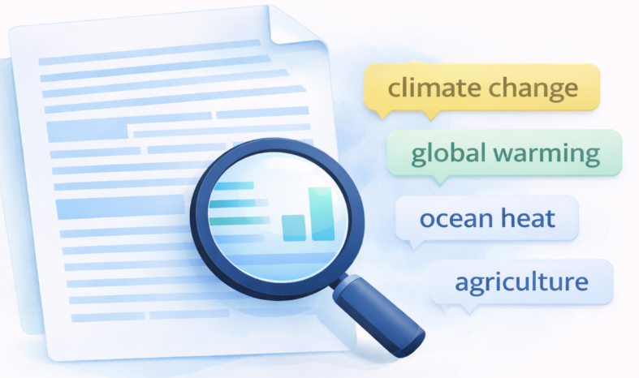

The **#semanticClimate tools** provides an innovative approach to manage climate data efficiently. This page provides an overview of these tools and their practical applications in semantifying the climate reports and data.

**Requirements for Installing Tools with `pip`** : 

- **Python** : Ensure that Python is installed on your system. Download python from [here](https://www.python.org/downloads/) and select the option Add Python to Path while installing.
  
- **pip** : `pip` is the package installer for Python. Verify that pip is installed by running: `pip --version` 

<style>
.tools-section {
  max-width: 1100px;
  margin: 60px auto;
  padding: 20px;
  text-align: center;
  font-family: system-ui, -apple-system, sans-serif;
}

.tools-section h2 {
  font-size: 2.2rem;
  margin-bottom: 10px;
  color: #07232f;
}

.tools-section p.section-subtitle {
  color: #000000;
  margin-bottom: 40px;
}

/* GRID: EXACTLY 3 PER ROW */
.tools-grid {
  display: grid;
  grid-template-columns: repeat(3, 1fr);
  gap: 40px 30px;
}

/* CLICKABLE CARD STYLE */
.tool-item {
  display: block;
  text-decoration: none;
  color: inherit;
  padding: 25px;
  border-radius: 14px;
  transition: all 0.25s ease;
  background: #c5e0e5;
}

.tool-item:hover {
  background: #e9f5c1;
  transform: translateY(-6px);
  box-shadow: 0 10px 25px rgba(0,0,0,0.08);
}

.tool-item img {
  width: 70px;
  height: 70px;
  object-fit: contain;
  margin-bottom: 15px;
}

.tool-item h3 {
  font-size: 1.8rem;
  margin-bottom: 8px;
  color: #240723;
}

.tool-item p {
  font-size: 0.9rem;
  color: #555;
  line-height: 1.5;
}

/* RESPONSIVE */
@media (max-width: 992px) {
  .tools-grid {
    grid-template-columns: repeat(2, 1fr);
  }
}

@media (max-width: 600px) {
  .tools-grid {
    grid-template-columns: 1fr;
  }
}
</style>

<section class="tools-section">

<h2>semanticClimate Tools</h2>
<p class="section-subtitle">
Tools developed by semanticClimate for literature mining, data extraction, and knowledge graph building.
</p>

<div class="tools-grid">

  <a href="{{ '/en/posts/amilib_description/' | url }}" class="tool-item">
    
    <h3>amilib</h3>
    <p>Python library designed for finding, cleaning, converting, searching, republishing legacy documents (PDF, PNG, etc.).</p>
  </a>

  <a href="{{ '/en/posts/amilib_description/' | url }}" class="tool-item">
    
    <h3>pygetpapers</h3>
    <p>Tool to search and download scientific research articles from open access repository.</p>
  </a>

  <a href="{{ '/en/posts/amilib_description/' | url }}" class="tool-item">
    
    <h3>docanalysis</h3>
    <p>It is a command-line tool that processes document collections (CProjects) and performs text analysis.</p>
  </a>

  <a href="/tools/txt2phrases_T4/" class="tool-item">
    
    <h3>txt2phrases</h3>
    <p>Python library for converting documents (HTML, PDF) into plain text, extracting keywords.</p>
  </a>

  <a href="/tools/encyclopedia_T5/" class="tool-item">
    
    <h3>encyclopedia</h3>
    <p>toolset for extracting and analyzing keywords from scientific documents and enhancing knowledge with Wikimedia.</p>
  </a>

  <a href="/tools/semantic_corpus/" class="tool-item">
    
    <h3>semantic_corpus</h3>
    <p>Python tool designed for researchers to create and manage personal scientific corpora.</p>
  </a>

</div>

</section>


### ```amiclimate```

**Release Category**: `Alpha`

**Developed By:** Peter Murray-Rust

```amiclimate``` is a NLP and semantic software and material for managing climate knowledge.

It is a Python code for accessing and transforming key climate documents. A refactoring of the (bloated) ```pyamihtml``` repository and has the functionality for downloading and parsing

1.  IPCC reports
2.  IPCC glossary
3.  UNFCCC reports (COP, etc.)

This repository will NOT have the complete IPCC or UNFCCC corpus , but will have small exemplars.

- **Code Repository** - [github](https://github.com/petermr/amiclimate)

- **README file for ```amiclimate```** : [amiclimate/README.md](https://github.com/petermr/amiclimate/blob/main/README.md)

### ```pyamiimage```

**Release Category**: `Alpha`

**Developed By:** Peter Murray-Rust

```pyamiimage``` is a set of tools to extract semantic information from scientific diagrams.

The output of ```pyamiimage``` is an image with annotations of substrate, products and enzymes.

- **Installation** - Use the code `pip install pyamiimage` to install **`pyamiimage`**

- **Code Repository** - [github](https://github.com/petermr/pyamiimage)

- **README file of ```pyamiimage```** : [pyamiimage/README.md](https://github.com/petermr/pyamiimage/blob/main/README.md)


### ```pygetpapers```

**Release Category**: `Production`

**Developed By:** Ayush Garg

```pygetpapers``` is a tool to assist text miners. It makes requests to open access scientific text repositories, analyses the hits, and systematically downloads the articles without further interaction. 

It has been developed by  Ayush Garg under the guidance of the OpenVirus community and Peter Murray Rust and Rik Smith-Unna funded by ContentMine.

It comes with the packages pygetpapers and download tools which provide various functions to download, process and save research papers and their metadata.

We use ```pygetpapers``` for querying current and past scholarly literature in bulk.

- **Installation** - Use the code `pip install pygetpapers` to install **`pygetpapers`**

Check the successful installation with command : `pygetpapers --help`. You should see a help message come up.

- **Code Repository** - [github](https://github.com/petermr/pygetpapers)

- **README file of ```pygetpapers```** : [pygetpapers/README.md](https://github.com/petermr/pygetpapers/blob/main/README.md)

- **Tutorials (Jupyter Notebook/ Colab Notebook and video demo)**

  - [descriptive demo of the literature search with pygetpapers](https://youtu.be/cOW_NTeqErk)

  - [literature search: Google colab notebook](https://colab.research.google.com/drive/1-vM3BKV7NjvFXAdLGuqyNMh4VhPq6uMa?usp=sharing)

  - [Creating JQuery Datatables from the retrieved articles](https://colab.research.google.com/drive/1RumRjh0EnKcLDmXhtYvxqMKi39BX_sB1?usp=sharing)

### ```docanalysis```

**Release Category**: `Production`

**Developed By:** Shweata N. Hegde

**```docanalysis```** is a command-line tool that processes document collections (CProjects) and performs text analysis. 

It can:

1.  Divide documents into sections
2.  Perform text mining and natural language processing (NLP)
3.  Generate dictionaries of terms
   
It uses custom code along with Python tools like NLTK, and it can use spaCy or scispaCy for extracting and annotating entities. The tool creates summary data and word lists as output.

- **Installation** - Use the code `pip install docanalysis` to install **`docanalysis`**

Check the successful installation with command : `docanalysis --help`. You should see a help message come up.

- **Code Repository** - [github](https://github.com/petermr/docanalysis)

- **README file of ```docanalysis ```** : [docanalysis/README.md](https://github.com/petermr/docanalysis/blob/main/README.md)

- **Tutorials (Jupyter Notebook/ Colab Notebook)** 
  
  - [google colab notebook](https://colab.research.google.com/drive/1sT2Die3pV3dLcyHgwZBg3IxS2FJ_8W0-?usp=sharing)
  
  - [Search for specific terms using dictionaries](https://colab.research.google.com/drive/1dbjq89FeIFMgUIzOPJBKg00tqzDe3uvB#scrollTo=jxgMYANusakv)